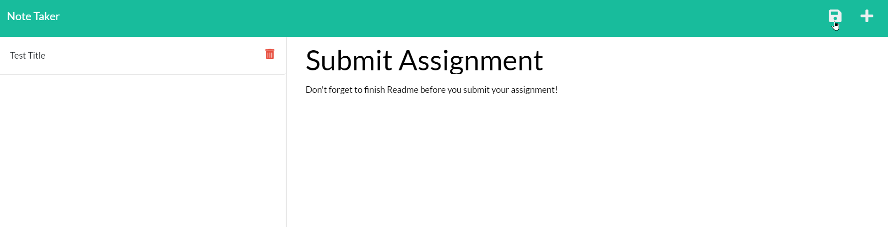

# noteTaker

  

   ## Description
    This project was designed to make personal or public notes and an easy to read lay out. Once you are finished with a note it can be deleted to make room for new notes.

   ## Installation
   To run this source code
   * Heroku: https://https://stark-dawn-28882.herokuapp.com
   * GitHub: https://christopherponzio.github.io/noteTaker
   * Repository: https://github.com/ChristopherPonzio/noteTaker

    ## Usage
    * To use the NoteTaker you need to have Node.js, NPM, and Express.js installed.
    * Once you open the file location in your terminal you can use "npm start" to start up a mock server to save notes to. 
    * With the application running you can simply type in a title and the note. Click the Save button and the note will be saved!

    * 

    ## Credits
    * Michelle Blackwell github: https://github/Mblackwellgca 
    * https://stackoverflow.com 
    * https://w3schools.com 
    * https://choosealicense.com 
    * https://img.shields.io

    ## License
    Licensed under the MIT license.
    https://choosealicense.com/licenses/mit